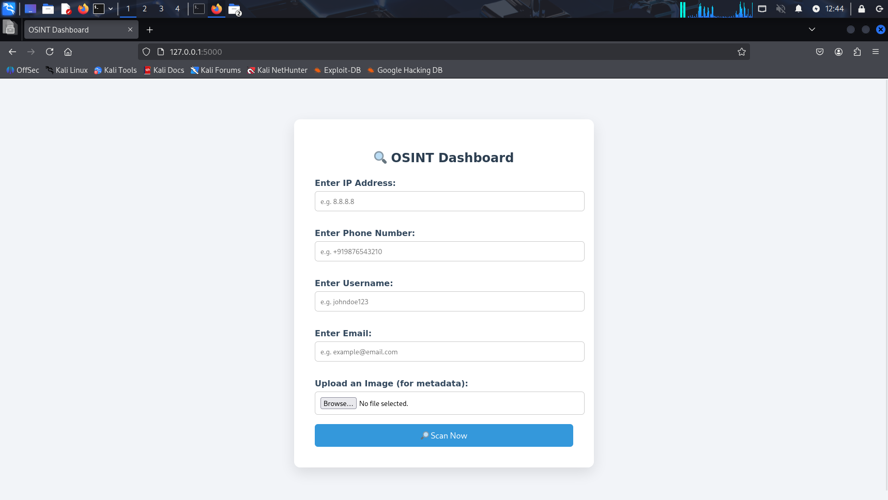

# 🕵️‍♂️ GetINTEL - OSINT Dashboard

A powerful and user-friendly OSINT (Open Source Intelligence) dashboard designed to help investigators, cybersecurity professionals, and analysts gather intelligence from publicly available information.  

This project integrates various OSINT tools and services into a single Flask-based web interface.

---

## 📸 Screenshot


---

## ✨ Features

- 🔍 **Username Enumeration** — Scan usernames across social media
- 📧 **Email Verification** — Check email presence using Hunter.io
- 📷 **Image Metadata Extraction** — Pull EXIF data from uploaded images
- 📱 **Phone Number Lookup** — Basic trace using open sources
- 🌍 **IP Address Lookup** — Fetch ISP, geolocation, ASN info
- 👤 **Maigret Integration** — Profiling from multiple social networks
- 📂 **Report Generation** — View and save search results as HTML

---
## 📁 Project Structure
GetINTEL/
│
├── app.py # Main Flask app
├── osint_modules/ # All OSINT feature modules
├── static/ # Uploads and reports
│ ├── uploads/
│ └── reports/
├── templates/ # HTML pages (Jinja2)
│ ├── index.html
│ └── result.html
├── maigret/ # Integrated Maigret tool
├── requirements.txt
├── README.md
└── .gitignore

---

## 🚀 Getting Started

### 🔧 Prerequisites

- Python 3.8+
- Git

### 📦 Installation
```bash
# Clone the repository
git clone https://github.com/aryandhanik1819/GetINTEL.git
cd GetINTEL

# Install dependencies
pip install -r requirements.txt
#Run the app
python app.py
#Visit http://127.0.0.1:5000 in your browser.


